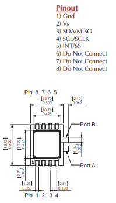
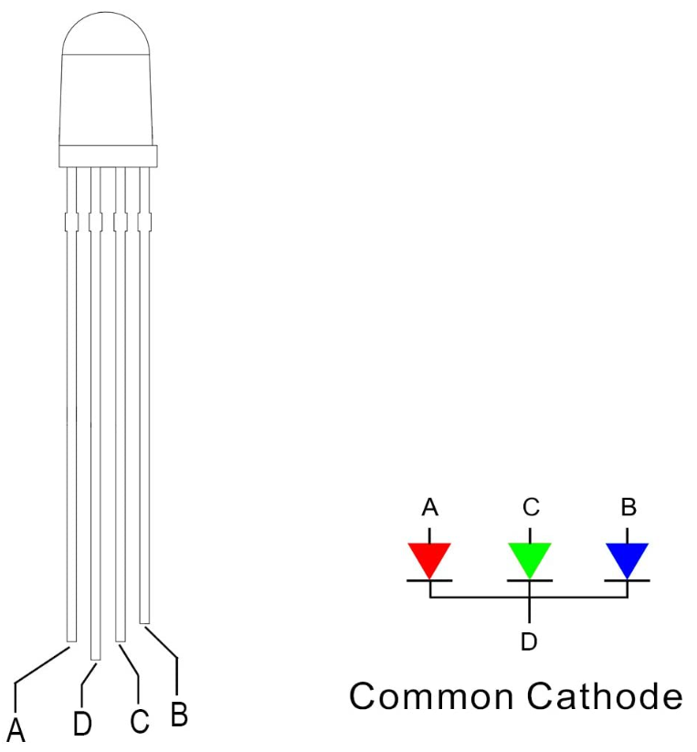

# Magic Feather

This is a raspberry pi based sensor package that is designed to detect the presence of infrasonic waves.  The original code this project was based on can be found [here](./old/)

The project is currently only designed to work with a [DLVR-L02D-E1NJ-C-NI3F pressure sensor](https://www.digikey.com/en/products/detail/amphenol-all-sensors-corporation/DLVR-L02D-E1NJ-C-NI3F/4383848?utm_adgroup=Temperature%20Sensors%20-%20NTC%20Thermistors&utm_source=google&utm_medium=cpc&utm_campaign=Shopping_Product_Sensors%2C%20Transducers_NEW&utm_term=&utm_content=Temperature%20Sensors%20-%20NTC%20Thermistors&gclid=EAIaIQobChMIt_iy85mW9gIViInICh3O_weDEAQYAiABEgIctfD_BwE).  However the project is planned to be expanded to include other sensors.

## Parts List

- Raspberry Pi 4 (4GB or higher)
  - Will need to run 64 bit Rasbian OS
- [DLVR-L02D-E1NJ-C-NI3F pressure sensor](https://www.digikey.com/en/products/detail/amphenol-all-sensors-corporation/DLVR-L02D-E1NJ-C-NI3F/4383848?utm_adgroup=Temperature%20Sensors%20-%20NTC%20Thermistors&utm_source=google&utm_medium=cpc&utm_campaign=Shopping_Product_Sensors%2C%20Transducers_NEW&utm_term=&utm_content=Temperature%20Sensors%20-%20NTC%20Thermistors&gclid=EAIaIQobChMIt_iy85mW9gIViInICh3O_weDEAQYAiABEgIctfD_Bw)
- [RGB LED](https://www.amazon.com/dp/B077XGF3YR)
- [Isolation Chamber](https://www.amazon.com/dp/B00FP0HOA4)
  - Note you can also 3D print the chamber
- [Barb Fittings](https://www.amazon.com/dp/B093GR5CD1)
- [Silicone Tubing](https://www.amazon.com/dp/B08PTX5QGJ)

## Making the sensor

Note you will need to use a 64bit OS for the raspberry pi due to some of the libraries being out of date and no longer compatible with the 32bit OS.

### Install the libraries

To run the code, you will first need to install the following libraries from the terminal:

`sudo apt install python3-obspy python3-smbus python3-serial python3-matplotlib ntpdate`

Then follow the instructions below to install RabbitMQ.

[Install RabbitMQ](https://www.rabbitmq.com/install-debian.html#apt-quick-start-cloudsmith)

You will also need the additional python packages installed to use RabbitMQ:

`pip3 install pika`

Finally set the pi to use ntpdate to sync the time by running the command:

`sudo timedatectl set-ntp true`

That should be everything you need to get the sensor up and running on the software side.

### Wire up the sensor

| |
| ---|
|  |
| Above is the pinout of the DLVR-L02D-E1NJ-C-NI3F pressure sensor.  For this project, we will only be using the first four pins.  |

| Sensor Pin | Raspberry Pi Pin | Description |
| --- | --- | --- |
| 1 | 6 | Ground |
| 2 | 1 | VCC |
| 3 | 3 | SDA |
| 4 | 5 | SCL |

### Wire up the LED

| |
| ---|
|  |
| Above is the pinout of the RGB LED used in this project. |

| LED Pin | Raspberry Pi Pin | Description |
| --- | --- | --- |
| A | 36 | Red |
| B | 40 | Blue |
| C | 38 | Green |
| D | 34 | Ground |

Note that because the GPIO pins on the pi are digital pins, we're not actually able to generate the full range of RGB colors.  This is because the pins can only ever be on or off, so we're only able to make the seven colors below:

  - Red
  - Green
  - Blue
  - Yellow
  - Cyan
  - Magenta
  - White

  ## Running the code

  The code was broken into multiple scripts to make it easier to edit, and to allow users to only run the parts they need.  

  [SensorReader](./sensorReader.py) is the main script that runs the sensor and sends the data to RabbitMQ.  It is used to generate the data that all the other modules will listen to.  

[DataLogger](./dataLogger.py) is the script that listens to the sensor data and logs it to a file.  It is also used to generate the alerts that the LED script will listen to.

[AlertLED](./alertLED.py) is the script that listens to the alerts and turns on the LED to indicate the presence of an alert.  It also handles writing the data to a USB stick whenever it detects one plugged in.  This allows the user to easily backup the data, even in headless mode.

[LiveView](./liveView.py) is the script that listens to the sensor data and displays it on the screen.  It was mainly made for debugging, but can be used to display the data on the screen for real time monitoring.